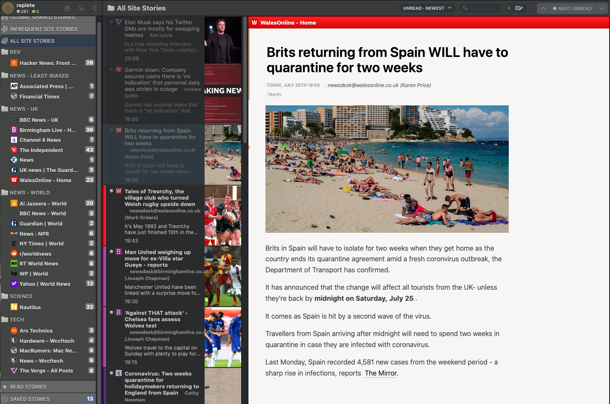

# Newsblur-replete theme

An opinionated theme extended for the native NewsBlur dark theme, adding a white story view. WIP

## Main features

* Mostly the redesigned story headers
* Fonts for Mac
* Minor tweaks for shitty `fulltextrss`-type feeds
* Bugs, because I rushed this in order to have readable

## Why 

I couldn't adjust the reading view in `Reeder Mac`, and thought I may as well write a user script to fix the basic Newsblur theme. I ~~stole~~ _was inspired by_ the headline/font styles.

## TODO
* [x] Make it usable
* [x] Style comments section
* [ ] Add code styles
* [ ] Rename/describe it better
* [ ] Check in other Mac browsers
* [ ] Check in Windows
* [ ] Put this on userscripts etc
* [ ] JS enhancements (clean markup in view perhaps)
