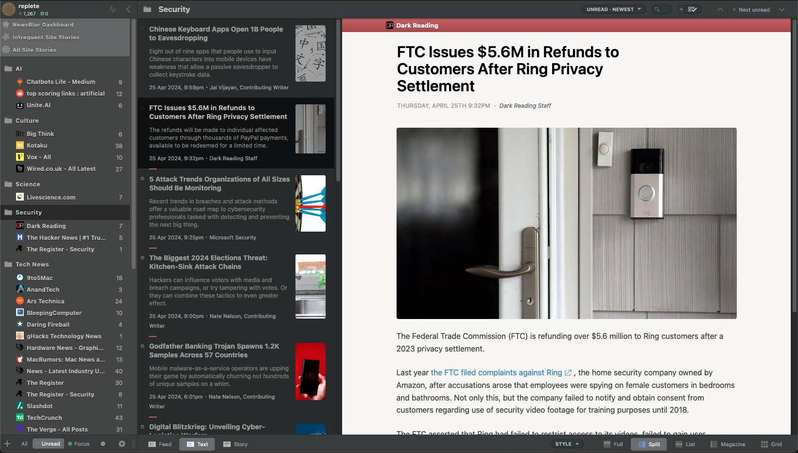

# Newsblur Replete Theme

This is a CSS stylesheet designed to be used on Newsblur with Dark mode enabled that adds the following features:

- Improved Reading experience – article typography, UI tweaks
- White story view – This mixed colour scheme works better for me for consuming a lot of content. At night time using the 'Dark Reader' browser extension can invert this with a click 
- Compact left sidebar
- Grid view - Faded preview content and layout tweaks
- Magazine view - Large images and titles suitable for vertical scrolling

## How to use

Enable dark theme in Newsblur, and either:
- Paste the CSS into `Newsblur > Settings > Account > Custom CSS/JS`
- Install `Stylus` browser extension and create a new UserStyles entry for newsblur.com and paste in the CSS

## Screenshots

